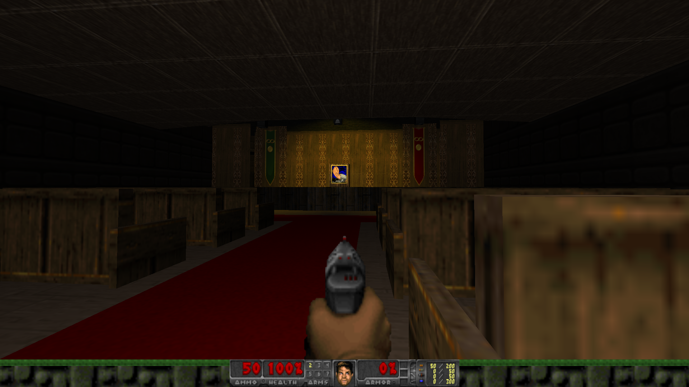

# AbberantGothic

Supernatural Detective Action Shooter in a post-apocalyptic South, where magic just suddenly started working one day and shit went bonkers.  

# Technical About

Built on the assets from the FreeDoom Project

[FreeDoom.github.io](https://freedoom.github.io/)

Intended for use with the GZDoom engine, and edited with Ultimate Doom Builder (UDB)
- Note: Uses Polyobjects and will incorporate scripting making it incompatible with other Doom Engines.

# Instructions to Play

Download GZDoom

[GZDoom Download at ZDoom.org](https://zdoom.org/downloads)

Drag and drop the latest .WAD File onto the GZDoom executable (For Windows)

???

PROFIT!

# Editing

The .WAD file can be edited natively with Ultimate Doom Builder.

[Ultimate Doom Builder Repo on GitHub](https://github.com/UltimateDoomBuilder/UltimateDoomBuilder)
